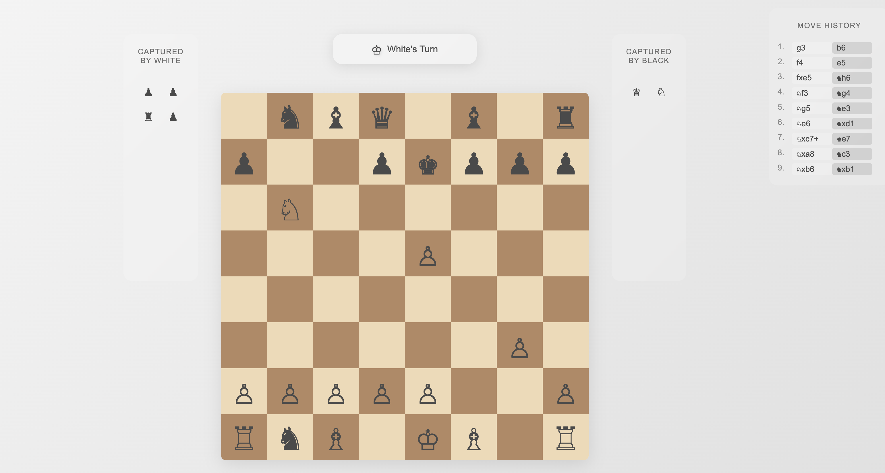

# Browser Chess Game

A simple chess game that runs directly in the browser without requiring any server or installation. Built with vanilla JavaScript, HTML, and CSS.

 *(You'll need to add a screenshot of your game)*

## Features

- Full chess game with all standard rules
- Move validation
- Castling support
- En passant moves
- Pawn promotion (to Queen)
- Move history with algebraic notation
- Captured pieces display
- Turn indicator
- Checkmate and stalemate detection

## How to Play

1. **Local Play:**
   - Download or clone this repository
   - Open `index.html` in your web browser
   - That's it! No server or installation needed

2. **Online Play:**
   Unfortunately, you can't play directly from GitHub as raw GitHub URLs don't execute JavaScript. However, you have several options to play online:

   - Deploy to [GitHub Pages](https://pages.github.com/) (free)
   - Deploy to [Netlify](https://www.netlify.com/) (free)
   - Deploy to [Vercel](https://vercel.com/) (free)

## Game Controls

- Click on a piece to select it
- Click on a valid square to move the selected piece
- Invalid moves will be rejected automatically
- The game automatically handles:
  - Turn switching
  - Move validation
  - Capture tracking
  - Check/Checkmate detection
  - Stalemate detection

## Technical Details

The game is built using:
- Vanilla JavaScript (ES6+)
- HTML5
- CSS3

No external libraries or dependencies required!

## Project Structure

```
chess/
├── index.html          # Main game page
├── style.css          # Game styling
├── constants.js       # Game constants and piece definitions
├── gameState.js       # Game state management
├── moves.js          # Move validation and rules
├── notation.js       # Chess notation and move history
├── board.js          # Board creation and rendering
└── ui.js             # UI event handlers
```

## Contributing

Feel free to open issues or submit pull requests if you find bugs or have suggestions for improvements!

## License

This project is open source and available under the [MIT License](LICENSE).

## Future Improvements

- [ ] Add sound effects
- [ ] Add multiplayer support
- [ ] Add AI opponent
- [ ] Add move animations
- [ ] Add game save/load functionality
- [ ] Add move suggestions
- [ ] Add game analysis 